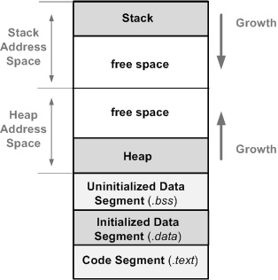

# Assembly (maintaining)


```assembly
[label] mnemonic [operands] [;comment]
```

## Synxtax
1. AT&T: `CMD <src>, <des> <#comment>`
2. intel: `CMD <des>, <src> <;comment>`

## Endian
ตัวอย่าง: `0x41424344`<br>
Big endian -> 41 42 43 44<br>
Little endian -> 44 43 42 41<br>

ตัวลงท้ายหลัง instructions:
- `b` = byte (8 bits)
- `w` = word (16 bits)
- `l` = long (32 bits)
- `q` = quad (64 bits)
- `t` = ten bytes (80 bites floating point)

# Disassemble
```
nasm -f elf64 file.s
```
**linking**
```
ld -o [output] -m elf_i386 [object_file]
```
# Memory Segment
1. **Text Segment**
2. **Data Segment**
3. **BSS Segment**
4. **Heap Segment**
5. **Stack Segment**<br>

มีต่อ


